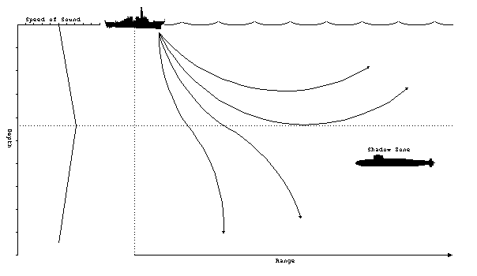
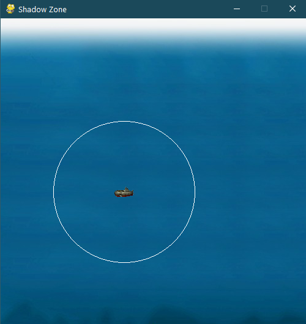
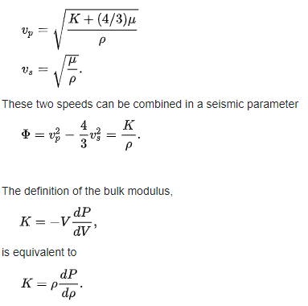

# shadow_zone
Excerpt from (https://fas.org/man/dod-101/navy/docs/es310/SNR_PROP/snr_prop.htm) regarding sonar propagation:

"Above the layer, the positive gradient will produce a surface duct as previously described. When rays penetrate below the layer, they are deflected downward. Therefore, the rays diverge above and below the layer. Beyond a certain minimum range, the rays from the source will never reach locations just below the layer. This is called the shadow zone. It is a favored depth for submarines to operate at for just this very reason. The optimum depth to operate at, called best depth (BD), is a function of the layer depth. The best depth can be calculated from [REDACTED]"

The Basic UI

This basic simulation of the sonar system for predicting the shadow zone will be utilizing the Adams–Williamson equation as shown

